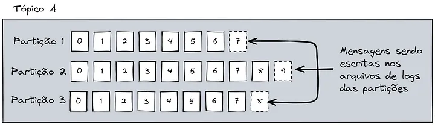
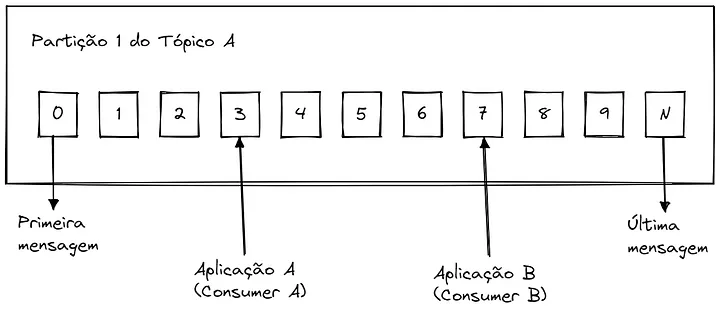
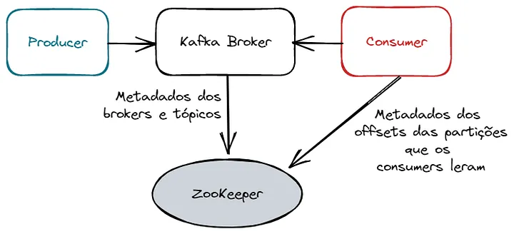

### Como funciona o Apache Kafka?
O Apache Kafka é composto por alguns componentes principais:

Mensagens: Um dado (ou evento) no Kafka é chamado de mensagem e um conjunto de mensagens é chamado de lote (ou batch);
Tópicos: Local onde as mensagens são armazenadas;
Partições: Os tópicos são divididos em partições;
Segmentos de log: As mensagens do Kafka são escritas em arquivos de logs dentro das partições;
Broker: É o servidor do Kafka, responsável por receber as mensagens dos producers, escrever as mensagens no disco e disponibilizar para os consumers;
Producer: Serviço(s) responsável(eis) por enviar enviar as mensagens para o Kafka;
Consumer: Serviço(s) responsável(eis) por ler as mensagens do Kafka.
No Kafka, um dado (ou evento) é imutável e é chamado de mensagem. Vindo de um contexto de banco de dados, cada tópico seria uma tabela, e cada mensagem seria uma linha dela. Para ter mais eficiência, as mensagens no Kafka são escritas em batches (ou mini batches).

As mensagens são enviadas para um tópico pelos Producers, que fazem uma conexão com o(s) broker(s). Esses, por sua vez, são responsáveis por escrever e armazenar as mensagens, de forma durável e ordenada, dentro das partições que são distribuídas entre eles, para serem lidas pelo(s) Consumer. As mensagens são escritas no final de cada arquivo de log das partições:


Cada consumer lê as mensagens do início ao fim de cada partição:


Idealmente, o Kafka foi desenvolvido para trabalhar como um conjunto de brokers, chamado de cluster, para ter um processamento de forma paralela e distribuída.

Além disso, é possível configurar os brokers para que repliquem os dados entre as partições.

Portanto, podemos configurar para vários producers enviarem mensagens para um cluster de brokers, com as mensagens dos tópicos sendo replicadas nas partições entre eles, e vários consumers consumindo os dados dessas partições:

Para controlar os metadados do Apache Kafka, versões atuais utilizam o Apache Zookeeper.

O Apache Zookeeper é um serviço centralizado para manter informações de configuração, nomear e providenciar sincronização distribuída em grupo de serviços.

O Zookeeper é bastante utilizado para controlar metadados por serviços distribuídos, como o Apache Kafka.

Ele armazena metadados dos brokers e tópicos (ajudando os servidores de Kafka a se recuperarem em caso de falha) e metadados dos offsets das mensagens lidas pelos consumers na partição.

### O que diferencia o Kafka de outros serviços de mensageria?

### Os brokers do Kafka não têm a responsabilidade de enviar a mensagem para um outro serviço
Diferente de outros serviços de mensageria como RabbitMQ e Google Pub/Sub, o único trabalho do Kafka é receber a mensagem enviada pelo producer, escrever ela em arquivos de log e utilizar a memória para manter o que está sendo escrito em cache de página, para uma escrita e leitura mais rápida. É responsabilidade do consumer assinar um tópico para receber as mensagens, efetuar determinado processamento e/ou escrever em uma base de dados, por exemplo.


### Garantia da entrega da mensagem
Serviços de mensageria possuem 3 semânticas de garantia de entrega das mensagens:

At-least-once: Pelo menos uma mensagem vai ser entregue, podendo haver duplicação de dados;
At-most-once: No máximo uma mensagem vai ser entregue, podendo haver perdas de dados;
Exactly-once: Exatamente uma mensagem vai ser entregue, sem duplicações e perdas.
Com um pequeno esforço, é possível configurar o Kafka para atingir a semântica exactly-once, que a maioria dos sistemas de mensageria não consegue, tendo esses que adicionar outra operação para deduplicar o dado na base de dados final.

Obs.: Essa garantia é apenas para a operação dos brokers do Kafka e retries do producers. Caso a aplicação por algum motivo instancie o producer 2 vezes com a mesma mensagem, elas serão escritas. Por exemplo, vamos imaginar que um cliente realize 2 transações bancárias idênticas (2 saques, mudando o timestamp entre elas). O Kafka não pode considerar que é apenas uma mensagem e eliminar o segundo saque, por exemplo.

### Iniciar o projeto 

## Requisitos
1. Docker e Docker Compose instalados.
2. .NET SDK instalado (versão 6 ou superior).
3. Offset Explorer

## Iniciar o Docker Compose
No terminal, dentro da pasta onde você criou o arquivo docker-compose.yml, execute o seguinte comando para iniciar o Kafka e o Zookeeper:

```bash
docker-compose up -d
```

## Execute o Produtor:

```bash
cd Kafka.Producer.Console
dotnet run 
```

## Executar Múltiplos Consumidores
```bash
cd Kafka.Consumer.Console
dotnet run 
```